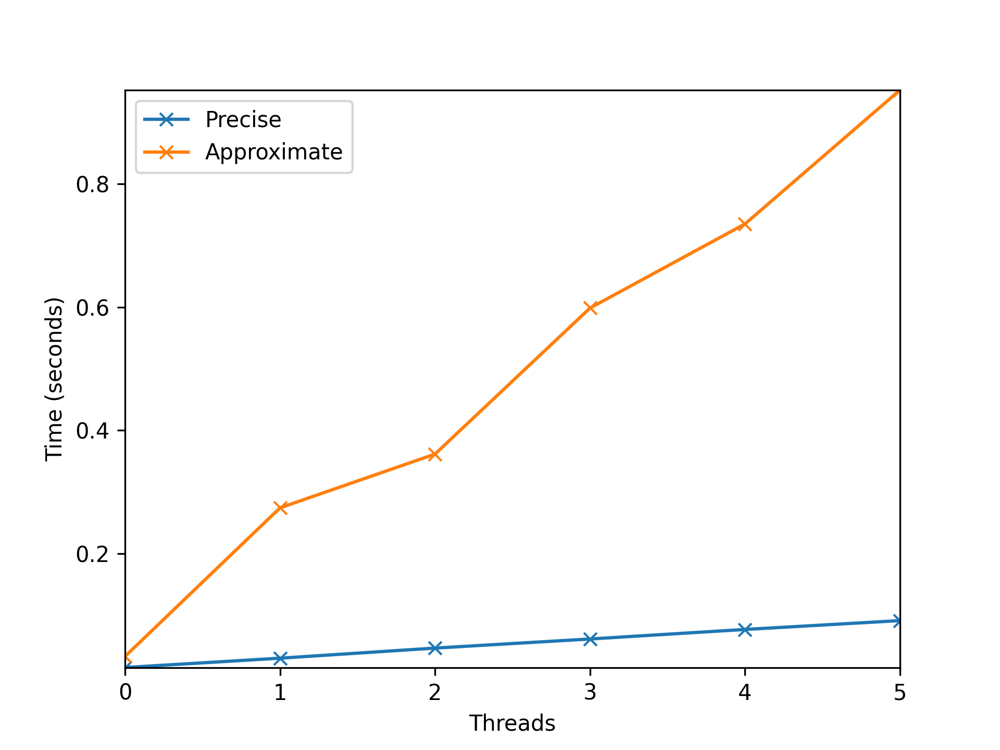
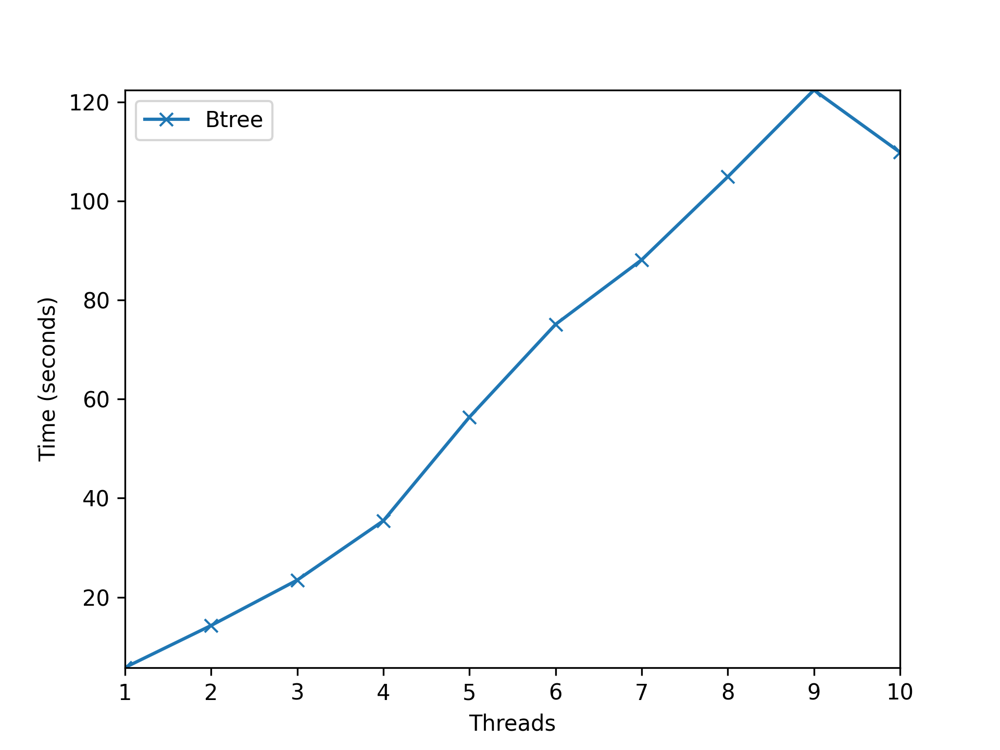

# Chapter 29 Lock-based Concurrent Data Structures  

## Concurrent Data Structure  

+ [concurrent linked list](./concurrent_linked_list.c)  
+ [concurrent queue](./concurrent_queue.c)  
## Homework  

---
### 1. We’ll start by redoing the measurements within this chapter. Use the call gettimeofday() to measure time within your program. How accurate is this timer? What is the smallest interval it can measure? Gain confidence in its workings, as we will need it in all subsequent questions. You can also look into other timers, such as the cycle counter available on x86 via the rdtsc instruction.

> [How to Benchmark Code Execution Times on Intel®IA-32 and IA-64 Instruction Set Architectures](https://www.intel.com/content/dam/www/public/us/en/documents/white-papers/ia-32-ia-64-benchmark-code-execution-paper.pdf)

> microseconds  

### 2. Now, build a simple concurrent counter and measure how long it takes to increment the counter many times as the number of threads increases. How many CPUs are available on the system you are using? Does this number impact your measurements at all?    

[simple_concurrent_counter.c](./simple_concurrent_counter.c)

```shell
0.015263 0.030379 0.046761 0.061528 0.077000 0.091352 
0.015700 0.083470 0.091815 0.145489 0.183284 0.236435 
0.016238 0.083252 0.099227 0.118351 0.167665 0.202726 
0.015649 0.072178 0.099315 0.176698 0.202149 0.274505 
0.015710 0.064861 0.100234 0.176128 0.226223 0.270946 
0.015740 0.078997 0.097957 0.163471 0.224911 0.296144
```




### 3. Next, build a version of the sloppy counter. Once again, measure its performance as the number of threads varies, as well as the threshold. Do the numbers match what you see in the chapter?  

[sloppy_counter.c](./sloppy_counter.c)  

```shell
espeon@Espeon:~/work/OSTEP/code/concurrency/ch29$ ./a.out 0
1: 0.033200 0.274310 0.361561 0.598504 0.735033 0.952322 
2: 0.026624 0.148486 0.233405 0.358212 0.474662 0.614110 
4: 0.023045 0.134013 0.182228 0.296255 0.406204 0.520148 
8: 0.020804 0.126154 0.165833 0.258369 0.359490 0.462559 
16: 0.020130 0.117978 0.153522 0.237807 0.310521 0.392752 
32: 0.019491 0.117341 0.148504 0.234476 0.315212 0.407668 
64: 0.019286 0.107864 0.139288 0.227050 0.292868 0.399338 
128: 0.019007 0.104595 0.138453 0.223876 0.280016 0.377089 
256: 0.019321 0.109070 0.143088 0.217458 0.292880 0.370967 
512: 0.018989 0.109378 0.139339 0.220152 0.293490 0.370451 
1024: 0.018997 0.104352 0.140361 0.207275 0.268334 0.367954 
```

Results of 6 threads:  


### 4. Build a version of a linked list that uses hand-over-hand locking[MS04], as cited in the chapter. You should read the paper first to understand how it works, and then implement it. Measure its performance. When does a hand-over-hand list work better than a standard list as shown in the chapter?

[hand-over-hand-linked-list.c](./hoh_list.c)  


> Never.  

### 5. Pick your favorite interesting data structure, such as a B-tree or other slightly more interested structure. Implement it, and start with a simple locking strategy such as a single lock. Measure its performance as the number of concurrent threads increases.  

[btree.c](./btree.c)

```shell
5.814809 14.298914 23.459987 35.435726 56.374765 75.094495 88.125039 104.881222 122.401781 109.825442
```  
