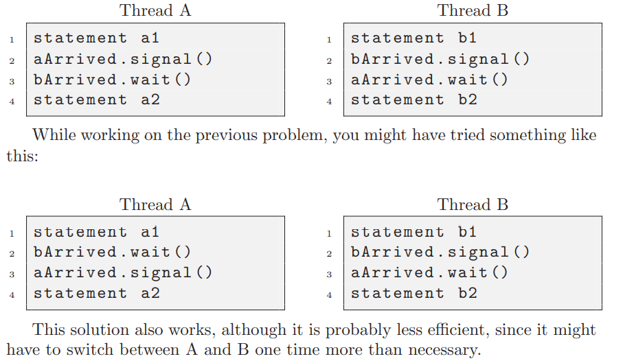
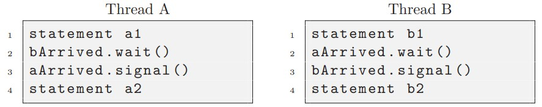

# Chapter 31 Semaphore

## Homework 

> In this homework, we’ll use semaphores to solve some well-known concurrency problems. Many of these are taken from Downey’s excellent “[Little Book of Semaphores](https://greenteapress.com/semaphores/LittleBookOfSemaphores.pdf)”, which does a good job of pulling together a number of classic problems as well as introducing a few new variants; interested readers should check out the Little Book for more fun.

> Each of the following questions provides a code skeleton; your job is to fill in the code to make it work given semaphores. On Linux, you will be using native semaphores; on a Mac (where there is no semaphore support), you’ll have to first build an implementation (using locks and condition variables, as described in the chapter). Good luck!


### 1. The first problem is just to implement and test a solution to the fork/join problem, as described in the text. Even though this solution is described in the text, the act of typing it in on your own is worthwhile; even Bach would rewrite Vivaldi, allowing one soon-to-be master to learn from an existing one. See fork-join.c for details. Add the call sleep(1) to the child to ensure it is working.  

```c
#include <stdio.h>
#include <unistd.h>
#include <pthread.h>
#include "common_threads.h"

sem_t s; 

void *child(void *arg) {
    printf("child\n");
    sem_post(&s);// use semaphore here
    return NULL;
}

int main(int argc, char *argv[]) {
    pthread_t p;
    
    printf("parent: begin\n");
    sem_init(&s, 0, 1);// init semaphore here
    Pthread_create(&p, NULL, child, NULL);
    sem_wait(&s);// use semaphore here
    sleep(1);
    printf("parent: end\n");
    return 0;
}
```

`gcc -o fork-join fork-join.c -Wall -pthread`  
`./fork-join`  
```shell
parent: begin
child
parent: end
```

### 2. Let’s now generalize this a bit by investigating the rendezvous problem. The problem is as follows: you have two threads, each of which are about to enter the rendezvous point in the code. Neither should exit this part of the code before the other enters it. Consider using two semaphores for this task, and see rendezvous.c for details.

> Little Book of Semaphore Chapter 3.3  



> Notice that:  


> will result in deadlock.  

### 3. Now go one step further by implementing a general solution to barrier synchronization. Assume there are two points in a sequential piece of code, called P1 and P2. Putting a barrier between P1 and P2 guarantees that all threads will execute P1 before any one thread executes P2. Your task: write the code to implement a barrier() function that can be used in this manner. It is safe to assume you know N (the total number of threads in the running program) and that all N threads will try to enter the barrier. Again, you should likely use two semaphores to achieve the solution, and some other integers to count things. See barrier.c for details. 

> Chapter 3.6.  

Non-solution: 

```c
void barrier(barrier_t *b) {
    sem_wait(&b->mutex);// barrier code goes here
        b->count = b->count + 1;
    sem_post(&b->mutex);

    if(b->count == b-> num_of_threads)
        sem_post(&b->barrier);
    
    sem_wait(&b->barrier);
    return;
}
```
> Of course it's a deadlock.  

```shell
espeon@Espeon:~/work/OSTEP/code/concurrency/ch31$ ./barrier 5
parent: begin
child 0: before
child 1: before
child 2: before
child 3: before
child 4: before
child 4: after
```

Solution:
```c
void barrier(barrier_t *b) {
    sem_wait(&b->mutex);// barrier code goes here
        b->count = b->count + 1;
    sem_post(&b->mutex);

    if(b->count == b-> num_of_threads)
        sem_post(&b->barrier);
    
    sem_wait(&b->barrier);
    sem_post(&b->barrier);
    return;
}
```

```
espeon@Espeon:~/work/OSTEP/code/concurrency/ch31$ gcc -o barrier barrier.c -Wall -pthread
espeon@Espeon:~/work/OSTEP/code/concurrency/ch31$ ./barrier 5
parent: begin
child 0: before
child 1: before
child 2: before
child 3: before
child 4: before
child 4: after
child 0: after
child 1: after
child 3: after
child 2: after
parent: end
```

### 4. Now let’s solve the reader-writer problem, also as described in the text. In this first take, don’t worry about starvation. See the code in reader-writer.c for details. Add sleep() calls to your code to demonstrate it works as you expect. Can you show the existence of the starvation problem?

[reader-writer.c](./reader-writer.c)  

`gcc -o reader-writer reader-writer.c -Wall -pthread`  


> Any number of readers can be in the critical section simultaneously. Writers must have exclusive access to the critical section. In other words, a writer cannot enter the critical section while any other thread (reader or writer) is there, and while the writer is there, no other thread may enter. 
> --The Little Book of Semaphore chapter 4.2  

### 5. Let’s look at the reader-writer problem again, but this time, worry about starvation. How can you ensure that all readers and writers eventually make progress? See reader-writer-nostarve.c for details.  

[reader-writer-nostarve.c](./reader-writer-nostarve.c)

`gcc -o nostarve reader-writer-nostarve.c -Wall -pthread`  
`./nostarve 10 1 10`  

```shell
read 0
read 0
read 0
write 1
write 2
write 3
write 4
write 5
write 6
write 7
write 8
write 9
write 10
read 10
read 10
read 10
```

### 6. Use semaphores to build a no-starve mutex, in which any thread that tries to acquire the mutex will eventually obtain it. See the code in mutex-nostarve.c for more information.  

[mutex-nostarve.c](./mutex-nostarve.c)  

```shell
espeon@Espeon:~/work/OSTEP/code/concurrency/ch31$ gcc -o mutex ./mutex-nostarve.c -Wall -pthread
espeon@Espeon:~/work/OSTEP/code/concurrency/ch31$ ./mutex 6
parent: begin
counter: 6
parent: end
espeon@Espeon:~/work/OSTEP/code/concurrency/ch31$ ./mutex 100
parent: begin
counter: 100
parent: end
espeon@Espeon:~/work/OSTEP/code/concurrency/ch31$ ./mutex 10000
parent: begin
counter: 10000
parent: end
espeon@Espeon:~/work/OSTEP/code/concurrency/ch31$ ./mutex 20000
parent: begin
counter: 20000
parent: end
```

### 7. Liked these problems? See Downey’s free text for more just like them. And don’t forget, have fun! But, you always do when you write code, no?
