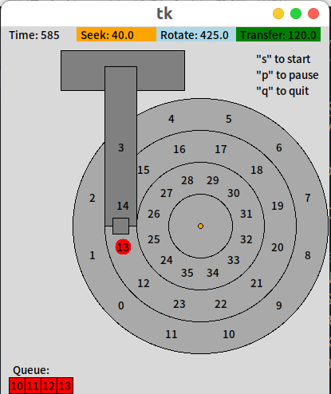
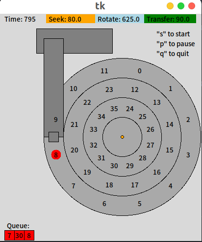
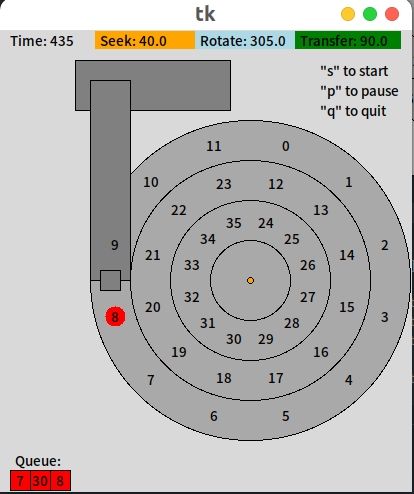
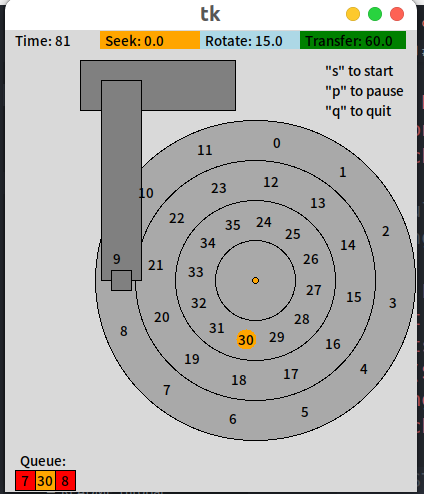
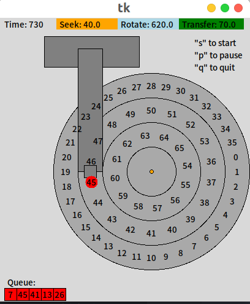

# Chapter 37 Hard Disk Drives  

This homework uses disk.py to familiarize you with how a modern hard drive works. It has a lot of different options, and unlike most of the other simulations, has a graphical animator to show you exactly what happens when the disk is in action. See the README for details.

### 1. Compute the seek, rotation, and transfer times for the following sets of requests: -a 0,-a 6,-a 30,-a 7,30,8, and finally -a 10,11,12,13.

`./disk.py -a 10,11,12,13 -G`  



### 2. Do the same requests above, but change the seek rate to different values: -S 2,-S 4,-S 8,-S 10,-S 40,-S 0.1. How do the times change?

`./disk.py -a 7,30,8 -G -S 2`  

```shell
REQUESTS ['7', '30', '8']

Block:   7  Seek:  0  Rotate: 15  Transfer: 30  Total:  45
Block:  30  Seek: 40  Rotate:260  Transfer: 30  Total: 330
Block:   8  Seek: 40  Rotate:350  Transfer: 30  Total: 420

TOTALS      Seek: 80  Rotate:625  Transfer: 90  Total: 795
```



`./disk.py -a 7,30,8 -G -S 4`  

```shell
REQUESTS ['7', '30', '8']

Block:   7  Seek:  0  Rotate: 15  Transfer: 30  Total:  45
Block:  30  Seek: 20  Rotate:280  Transfer: 30  Total: 330
Block:   8  Seek: 20  Rotate: 10  Transfer: 30  Total:  60

TOTALS      Seek: 40  Rotate:305  Transfer: 90  Total: 435
```


### 3. Do the same requests above, but change the rotation rate: -R 0.1,-R 0.5,-R 0.01. How do the times change?

> Default value is 1. Rotate time and transfer time are longer.  

### 4. FIFO is not always best, e.g., with the request stream -a 7,30,8, what order should the requests be processed in? Run the shortest seek-time first (SSTF) scheduler (-p SSTF) on this workload; how long should it take (seek, rotation, transfer) for each request to be served?

`./disk.py -a 7,30,8 -G -p SSTF`  



### 5. Now use the shortest access-time first(SATF) scheduler(-p SATF). Does it make any difference for -a 7,30,8 workload? Find a set of requests where SATF outperforms SSTF; more generally, when is SATF better than SSTF?

> No difference, since 7 and 8 is on the same track and the minimal distance is between 7 and 8, so the performances of SATF and SSTF are same.  

### 6. Here is a request stream to try: -a 10,11,12,13. What goes poorly when it runs? Try adding track skew to address this problem (-o skew). Given the default seek rate, what should the skew be to maximize performance? What about for different seek rates (e.g., -S 2, -S 4)? In general, could you write a formula to figure out the skew?  

> skew = track-distance(40) / seek-speed / (rotational-space-degrees(360 / 12) * rotation-speed) = 40 / 1 / (30 * 1) ≈ 2

### 7. Specify a disk with different density per zone, e.g., -z 10,20,30, which specifies the angular difference between blocks on the outer, middle, and inner tracks. Run some random requests (e.g., -a -1 -A 5,-1,0, which specifies that random requests should be used via the -a -1 flag and that five requests ranging from 0 to the max be generated), and compute the seek, rotation, and transfer times. Use different random seeds. What is the bandwidth (in sectors per unit time) on the outer, middle, and inner tracks?

`./disk.py -z 10,20,30 -a -1 -A 5,-1,0 -c -s 1 -G -p SATF`  

 

### 8. A scheduling window determines how many requests the disk can examine at once. Generate random workloads (e.g., -A 1000,-1,0, with different seeds) and see how long the SATF scheduler takes when the scheduling window is changed from 1 up to the number of requests. How big of a window is needed to maximize performance? Hint: use the -c flag and don’t turn on graphics (-G) to run these quickly. When the scheduling window is set to 1, does it matter which policy you are using?

```shell
$ ./disk.py -A 1000,-1,0 -p SATF -w 1 -c      // 220125
$ ./disk.py -A 1000,-1,0 -p FIFO -w 1 -c      // 220125
$ ./disk.py -A 1000,-1,0 -p SSTF -w 1 -c      // 220125
$ ./disk.py -A 1000,-1,0 -p BSATF -w 1 -c     // 220125
$ ./disk.py -A 1000,-1,0 -p SATF -w 1000 -c   // 35475
```

### 9. Create a series of requests to starve a particular request, assuming an SATF policy. Given that sequence, how does it perform if you use a bounded SATF (BSATF) scheduling approach? In this approach, you specify the scheduling window (e.g., -w 4); the scheduler only moves onto the next window of requests when all requests in the current window have been serviced. Does this solve starvation? How does it perform, as compared to SATF? In general, how should a disk make this trade-off between performance and starvation avoidance?  

`./disk.py -a 12,7,8,9,10,11 -p SATF -c -G          // 7,8,9,10,11,12 Total: 555`  
`./disk.py -a 12,7,8,9,10,11 -p BSATF -w 4 -c -G   // 7,8,9,12,10,11 Total: 525`  

### 10. All the scheduling policies we have looked at thus far are greedy; they pick the next best option instead of looking for an optimal schedule. Can you find a set of requests in which greedy is not optimal?  

`./disk.py -a 9,20 -c -G`  
`./disk.py -a 9,20 -c -p SATF -G`  