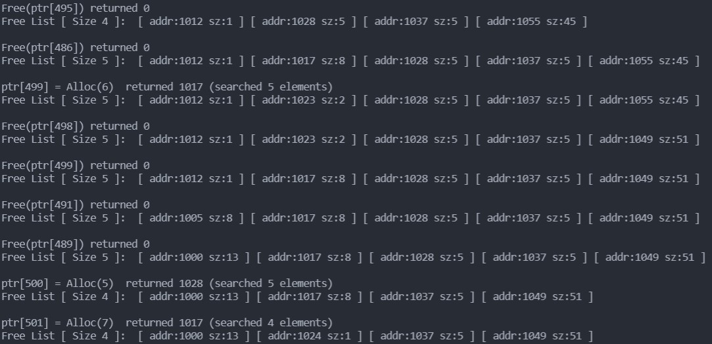
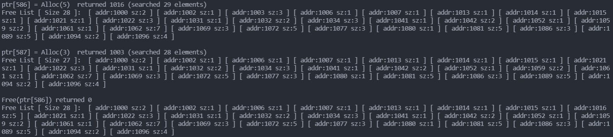

## 17. Free-Space Management  

### 1. First run with the flags -n 10 -H 0 -p BEST -s 0 to generate a few random allocations and frees. Can you predict what alloc()/free() will return? Can you guess the state of the free list after each request? What do you notice about the free list over time?  

`./malloc.py -n 10 -H 0 -p BEST -s 0 -c`  

```shell
seed 0
size 100
baseAddr 1000
headerSize 0
alignment -1
policy BEST
listOrder ADDRSORT
coalesce False
numOps 10
range 10
percentAlloc 50
allocList 
compute True

ptr[0] = Alloc(3)  returned 1000 (searched 1 elements)
Free List [ Size 1 ]:  [ addr:1003 sz:97 ] 

Free(ptr[0]) returned 0
Free List [ Size 2 ]:  [ addr:1000 sz:3 ] [ addr:1003 sz:97 ] 

ptr[1] = Alloc(5)  returned 1003 (searched 2 elements)
Free List [ Size 2 ]:  [ addr:1000 sz:3 ] [ addr:1008 sz:92 ] 

Free(ptr[1]) returned 0
Free List [ Size 3 ]:  [ addr:1000 sz:3 ] [ addr:1003 sz:5 ] [ addr:1008 sz:92 ] 

ptr[2] = Alloc(8)  returned 1008 (searched 3 elements)
Free List [ Size 3 ]:  [ addr:1000 sz:3 ] [ addr:1003 sz:5 ] [ addr:1016 sz:84 ] 

Free(ptr[2]) returned 0
Free List [ Size 4 ]:  [ addr:1000 sz:3 ] [ addr:1003 sz:5 ] [ addr:1008 sz:8 ] [ addr:1016 sz:84 ] 

ptr[3] = Alloc(8)  returned 1008 (searched 4 elements)
Free List [ Size 3 ]:  [ addr:1000 sz:3 ] [ addr:1003 sz:5 ] [ addr:1016 sz:84 ] 

Free(ptr[3]) returned 0
Free List [ Size 4 ]:  [ addr:1000 sz:3 ] [ addr:1003 sz:5 ] [ addr:1008 sz:8 ] [ addr:1016 sz:84 ] 

ptr[4] = Alloc(2)  returned 1000 (searched 4 elements)
Free List [ Size 4 ]:  [ addr:1002 sz:1 ] [ addr:1003 sz:5 ] [ addr:1008 sz:8 ] [ addr:1016 sz:84 ] 

ptr[5] = Alloc(7)  returned 1008 (searched 4 elements)
Free List [ Size 4 ]:  [ addr:1002 sz:1 ] [ addr:1003 sz:5 ] [ addr:1015 sz:1 ] [ addr:1016 sz:84 ] 
``` 

### 2.  How are the results different when using a WORST fit policy to search the free list (-p WORST)? What changes?  

> It always finds the largest block.  

`./malloc.py -n 10 -H 0 -p WORST -s 0 -c`  

```shell
seed 0
size 100
baseAddr 1000
headerSize 0
alignment -1
policy WORST
listOrder ADDRSORT
coalesce False
numOps 10
range 10
percentAlloc 50
allocList 
compute True

ptr[0] = Alloc(3)  returned 1000 (searched 1 elements)
Free List [ Size 1 ]:  [ addr:1003 sz:97 ] 

Free(ptr[0]) returned 0
Free List [ Size 2 ]:  [ addr:1000 sz:3 ] [ addr:1003 sz:97 ] 

ptr[1] = Alloc(5)  returned 1003 (searched 2 elements)
Free List [ Size 2 ]:  [ addr:1000 sz:3 ] [ addr:1008 sz:92 ] 

Free(ptr[1]) returned 0
Free List [ Size 3 ]:  [ addr:1000 sz:3 ] [ addr:1003 sz:5 ] [ addr:1008 sz:92 ] 

ptr[2] = Alloc(8)  returned 1008 (searched 3 elements)
Free List [ Size 3 ]:  [ addr:1000 sz:3 ] [ addr:1003 sz:5 ] [ addr:1016 sz:84 ] 

Free(ptr[2]) returned 0
Free List [ Size 4 ]:  [ addr:1000 sz:3 ] [ addr:1003 sz:5 ] [ addr:1008 sz:8 ] [ addr:1016 sz:84 ] 

ptr[3] = Alloc(8)  returned 1016 (searched 4 elements)
Free List [ Size 4 ]:  [ addr:1000 sz:3 ] [ addr:1003 sz:5 ] [ addr:1008 sz:8 ] [ addr:1024 sz:76 ] 

Free(ptr[3]) returned 0
Free List [ Size 5 ]:  [ addr:1000 sz:3 ] [ addr:1003 sz:5 ] [ addr:1008 sz:8 ] [ addr:1016 sz:8 ] [ addr:1024 sz:76 ] 

ptr[4] = Alloc(2)  returned 1024 (searched 5 elements)
Free List [ Size 5 ]:  [ addr:1000 sz:3 ] [ addr:1003 sz:5 ] [ addr:1008 sz:8 ] [ addr:1016 sz:8 ] [ addr:1026 sz:74 ] 

ptr[5] = Alloc(7)  returned 1026 (searched 5 elements)
Free List [ Size 5 ]:  [ addr:1000 sz:3 ] [ addr:1003 sz:5 ] [ addr:1008 sz:8 ] [ addr:1016 sz:8 ] [ addr:1033 sz:67 ] 
```  

### 3. What about when using FIRST fit (-p FIRST)? What speeds up when you use first fit?  

> traverse time. It need not traverse the whole list.  

`./malloc.py -n 10 -H 0 -p FIRST -s 0 -c`  

```shell
seed 0
size 100
baseAddr 1000
headerSize 0
alignment -1
policy FIRST
listOrder ADDRSORT
coalesce False
numOps 10
range 10
percentAlloc 50
allocList 
compute True

ptr[0] = Alloc(3)  returned 1000 (searched 1 elements)
Free List [ Size 1 ]:  [ addr:1003 sz:97 ] 

Free(ptr[0]) returned 0
Free List [ Size 2 ]:  [ addr:1000 sz:3 ] [ addr:1003 sz:97 ] 

ptr[1] = Alloc(5)  returned 1003 (searched 2 elements)
Free List [ Size 2 ]:  [ addr:1000 sz:3 ] [ addr:1008 sz:92 ] 

Free(ptr[1]) returned 0
Free List [ Size 3 ]:  [ addr:1000 sz:3 ] [ addr:1003 sz:5 ] [ addr:1008 sz:92 ] 

ptr[2] = Alloc(8)  returned 1008 (searched 3 elements)
Free List [ Size 3 ]:  [ addr:1000 sz:3 ] [ addr:1003 sz:5 ] [ addr:1016 sz:84 ] 

Free(ptr[2]) returned 0
Free List [ Size 4 ]:  [ addr:1000 sz:3 ] [ addr:1003 sz:5 ] [ addr:1008 sz:8 ] [ addr:1016 sz:84 ] 

ptr[3] = Alloc(8)  returned 1008 (searched 3 elements)
Free List [ Size 3 ]:  [ addr:1000 sz:3 ] [ addr:1003 sz:5 ] [ addr:1016 sz:84 ] 

Free(ptr[3]) returned 0
Free List [ Size 4 ]:  [ addr:1000 sz:3 ] [ addr:1003 sz:5 ] [ addr:1008 sz:8 ] [ addr:1016 sz:84 ] 

ptr[4] = Alloc(2)  returned 1000 (searched 1 elements)
Free List [ Size 4 ]:  [ addr:1002 sz:1 ] [ addr:1003 sz:5 ] [ addr:1008 sz:8 ] [ addr:1016 sz:84 ] 

ptr[5] = Alloc(7)  returned 1008 (searched 3 elements)
Free List [ Size 4 ]:  [ addr:1002 sz:1 ] [ addr:1003 sz:5 ] [ addr:1015 sz:1 ] [ addr:1016 sz:84 ] 
```

### 4. For the above questions, how the list is kept ordered can affect the time it takes to find a free location for some of the policies. Use the different free list orderings (-l ADDRSORT, -l SIZESORT+, -l SIZESORT-) to see how the policies and the list orderings interact.  

> The default is ADDRSORT.  

`./malloc.py -n 10 -H 0 -p FIRST -s 0 -c -l SIZESORT-`  

```shell
seed 0
size 100
baseAddr 1000
headerSize 0
alignment -1
policy FIRST
listOrder SIZESORT-
coalesce False
numOps 10
range 10
percentAlloc 50
allocList 
compute True

ptr[0] = Alloc(3)  returned 1000 (searched 1 elements)
Free List [ Size 1 ]:  [ addr:1003 sz:97 ] 

Free(ptr[0]) returned 0
Free List [ Size 2 ]:  [ addr:1003 sz:97 ] [ addr:1000 sz:3 ] 

ptr[1] = Alloc(5)  returned 1003 (searched 1 elements)
Free List [ Size 2 ]:  [ addr:1008 sz:92 ] [ addr:1000 sz:3 ] 

Free(ptr[1]) returned 0
Free List [ Size 3 ]:  [ addr:1008 sz:92 ] [ addr:1003 sz:5 ] [ addr:1000 sz:3 ] 

ptr[2] = Alloc(8)  returned 1008 (searched 1 elements)
Free List [ Size 3 ]:  [ addr:1016 sz:84 ] [ addr:1003 sz:5 ] [ addr:1000 sz:3 ] 

Free(ptr[2]) returned 0
Free List [ Size 4 ]:  [ addr:1016 sz:84 ] [ addr:1008 sz:8 ] [ addr:1003 sz:5 ] [ addr:1000 sz:3 ] 

ptr[3] = Alloc(8)  returned 1016 (searched 1 elements)
Free List [ Size 4 ]:  [ addr:1024 sz:76 ] [ addr:1008 sz:8 ] [ addr:1003 sz:5 ] [ addr:1000 sz:3 ] 

Free(ptr[3]) returned 0
Free List [ Size 5 ]:  [ addr:1024 sz:76 ] [ addr:1008 sz:8 ] [ addr:1016 sz:8 ] [ addr:1003 sz:5 ] [ addr:1000 sz:3 ] 

ptr[4] = Alloc(2)  returned 1024 (searched 1 elements)
Free List [ Size 5 ]:  [ addr:1026 sz:74 ] [ addr:1008 sz:8 ] [ addr:1016 sz:8 ] [ addr:1003 sz:5 ] [ addr:1000 sz:3 ] 

ptr[5] = Alloc(7)  returned 1026 (searched 1 elements)
Free List [ Size 5 ]:  [ addr:1033 sz:67 ] [ addr:1008 sz:8 ] [ addr:1016 sz:8 ] [ addr:1003 sz:5 ] [ addr:1000 sz:3 ]
```

### 5. Coalescing of a free list can be quite important. Increase the number of random allocations (say to -n 1000). What happens to larger allocation requests over time? Run with and without coalescing (i.e., without and with the -C flag). What differences in outcome do you see? How big is the free list over time in each case? Does the ordering of the list matter in this case? 

> Coalescing: minimize the external fragmentation:  



> Without Coalescing: Lots of external fragmentation:  

  

### 6. What happens when you change the percent allocated fraction -P to higher than 50? What happens to allocations as it nears 100? What about as the percent nears 0?  

`./malloc.py -c -n 1000 -P 100`  
`./malloc.py -c -n 1000 -P 1`  

> No more memory can be allocated when -P is set to 100.  

### 7. What kind of specific requests can you make to generate a highly fragmented free space? Use the -A flag to create fragmented free lists, and see how different policies and options change the organization of the free list.  
```shell
./malloc.py -c -A +20,+20,+20,+20,+20,-0,-1,-2,-3,-4
./malloc.py -c -A +20,+20,+20,+20,+20,-0,-1,-2,-3,-4 -C
./malloc.py -c -A +10,-0,+20,-1,+30,-2,+40,-3 -l SIZESORT-
./malloc.py -c -A +10,-0,+20,-1,+30,-2,+40,-3 -l SIZESORT- -C
./malloc.py -c -A +10,-0,+20,-1,+30,-2,+40,-3 -p FIRST -l SIZESORT+
./malloc.py -c -A +10,-0,+20,-1,+30,-2,+40,-3 -p FIRST -l SIZESORT+ -C
./malloc.py -c -A +10,-0,+20,-1,+30,-2,+40,-3 -p FIRST -l SIZESORT-
./malloc.py -c -A +10,-0,+20,-1,+30,-2,+40,-3 -p FIRST -l SIZESORT- -C
./malloc.py -c -A +10,-0,+20,-1,+30,-2,+40,-3 -p WORST -l SIZESORT+
./malloc.py -c -A +10,-0,+20,-1,+30,-2,+40,-3 -p WORST -l SIZESORT+ -C
./malloc.py -c -A +10,-0,+20,-1,+30,-2,+40,-3 -p WORST -l SIZESORT-
./malloc.py -c -A +10,-0,+20,-1,+30,-2,+40,-3 -p WORST -l SIZESORT- -C
```


