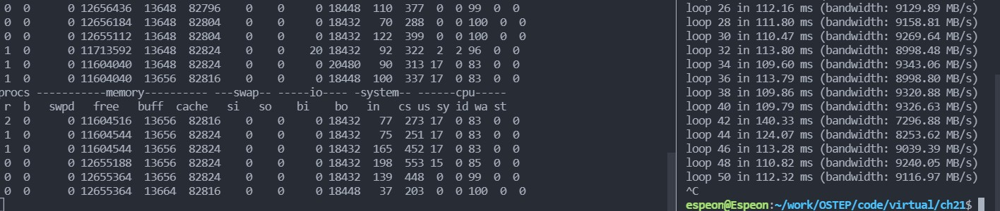

## 21. Beyond Physical Memory: Mechanisms 

### 1.  First, open two separate terminal connections to the same machine, so that you can easily run something in one window and the other. Now, in one window, run vmstat 1, which shows statistics about machine usage every second. Read the man page, the associated README, and any other information you need so that you can understand its output. Leave this window running vmstat for the rest of the exercises below. Now, we will run the program mem.c but with very little memory usage. This can be accomplished by typing ./mem 1 (which uses only 1 MB of memory). How do the CPU usage statistics change when running mem? Do the numbers in the user time column make sense? How does this change when running more than one instance of mem at once? 

> We can easily find that the user time increases and idle time decreases.  

`./mem 1`  

`./mem 1 & ./mem 1 &`

### 2. Let’s now start looking at some of the memory statistics while running mem. We’ll focus on two columns: swpd (the amount of virtual memory used) and free (the amount of idle memory). Run ./mem 1024 (which allocates 1024 MB) and watch how these values change. Then kill the running program (by typing control-c) and watch again how the values change. What do you notice about the values? In particular, how does the free column change when the program exits? Does the amount of free memory increase by the expected amount when mem exits?

> swpd doesn't change.  

  

### 3. We’ll next look at the swap columns (si and so), which indicate how much swapping is taking place to and from the disk. Of course, to activate these, you’ll need to run mem with large amounts of memory. First, examine how much free memory is on your Linux system (for example, by typing cat /proc/meminfo; type man proc for details on the /proc file system and the types of information you can find there). One of the first entries in /proc/meminfo is the total amount of memory in your system. Let’s assume it’s something like 8 GB of memory; if so, start by running mem 4000 (about 4 GB) and watching the swap in/out columns. Do they ever give non-zero values? Then, try with 5000, 6000, etc. What happens to these values as the program enters the second loop (and beyond), as compared to the first loop? How much data (total) are swapped in and out during the second, third, and subsequent loops? (do the numbers make sense?)